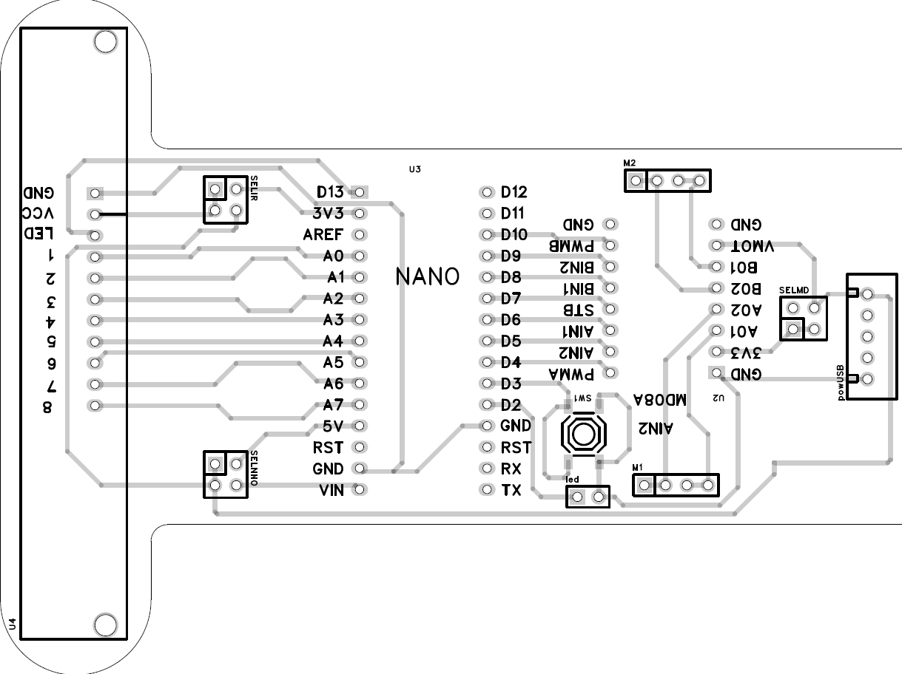

# Line-Following Robot Competition 2024

Welcome to the Line-Following Robot Competition 2024! This competition challenges participants to design and implement the best control system for a line-following robot using the provided components.

---

## Competition Details

### Component Constrains

- **Participants must use only the components provided by the organizers.**
- **No additional components or modifications are allowed.**

### Competition Objective

- The goal is to **design and implement the best control system for the line-following robot**.
- The robot that **completes the track in the fastest time** will be declared the winner.

### Provided Robot

- **All components are supplied by the organizers**, including:
  - Fully assembled PCB with all parts soldered.
  - Laser-cut chassis.
  - Wheels and other necessary components.
- **Participants only need to code the control system** for the robot.

---

## Provided Components

Participants will receive the following components as part of the assembled robot:

1. **Arduino Nano**
2. **QTR-8RC Reflectance Sensor Array**
3. **Motor Driver (TB6612FNG)**
4. **DC Motors**
5. **Wheels**
6. **Metal Ball Caster**

---

## Schematic Diagram

The schematic diagram of the line-following robot is provided in the `schematics` folder of this repository. Please refer to it for wiring and component connections.

> **Note:** If the schematic image is not displayed, please check the `schematics` folder in this repository for the diagram file.

---

## Component Details and Libraries

Below are the details of each component and links to their libraries/documentation to assist you in writing your code.

### 1. Arduino Nano

- **Description:** A small, complete, and breadboard-friendly microcontroller board based on the ATmega328P.
- **Documentation:** [Arduino Nano Official Documentation](https://docs.arduino.cc/hardware/nano)
- **Datasheet:** [ATmega328P Datasheet](https://www.microchip.com/wwwproducts/en/ATmega328P)

### 2. QTR-8RC Reflectance Sensor Array

- **Description:** An array of eight IR LED/phototransistor pairs for line detection, ideal for line-following robots.
- **User's Guide:** [Pololu QTR Reflectance Sensor Arrays User's Guide](https://www.pololu.com/docs/0J13)
- **Arduino Library:**
  - **QTRSensors Library:** Required for interfacing with the QTR sensor array.
  - **Installation:**
    - Via Arduino Library Manager: Search for "QTRSensors" by Pololu and install.
    - Or download from [GitHub - Pololu QTRSensors Library](https://github.com/pololu/qtr-sensors-arduino)

### 3. Motor Driver (TB6612FNG)

- **Description:** A dual motor driver capable of driving two DC motors with up to 1.2 A per channel.
- **Datasheet:** [TB6612FNG Motor Driver Datasheet](https://www.pololu.com/file/0J86/TB6612FNG.pdf)
- **Arduino Library:**
  - **SparkFun TB6612FNG Arduino Library**
  - **Installation:**
    - Via Arduino Library Manager: Search for "L298N" and install.
    - Or download from [GitHub - L298N Arduino Library](https://github.com/AndreaLombardo/L298N)

### 4. DC Motors

- **Description:** Standard DC motors compatible with the motor driver and suitable for driving the robot.

### 5. Wheels

- **Description:** Wheels compatible with the DC motors, providing traction and stability.

### 6. Metal Ball Caster

- **Description:** A rolling support that allows the robot to balance and turn smoothly.

---

## Assembly Instructions

- **Connect the Arduino Nano** to your computer via USB for programming.
- **Wire the QTR-8RC Sensor Array**:
  - Connect the sensor outputs (`OUT1` to `OUT8`) to analog input pins (`A0` to `A7`) on the Arduino Nano.
  - Provide power to the sensor array from the Arduino's `5V` and `GND` pins.
  - If the sensor array has an emitter control pin (`CTRL`), connect it to a digital pin (e.g., `D13`) or tie it directly to `VIN` to keep the emitters always on.
- **Motor Driver Connections (TB6612FNG)**:
  - **Inputs**:
    - `PWMA` (Motor A PWM): Connect to Arduino's PWM-capable pin (e.g., `D4`).
    - `AIN1`, `AIN2` (Motor A Control): Connect to digital pins (e.g., `D6`, `D5`).
    - `PWMB` (Motor B PWM): Connect to another PWM-capable pin (e.g., `D10`).
    - `BIN1`, `BIN2` (Motor B Control): Connect to digital pins (e.g., `D8`, `D9`).
    - `STBY` (Standby): Connect to a digital pin (e.g., `D7`), set to `HIGH` to enable the driver.
    - `EMITTERPIN` : Connected to digital pins (e.g., `D13`)
  - **Outputs**:
    - `A01`, `A02`: Connect to the terminals of Motor A.
    - `B01`, `B02`: Connect to the terminals of Motor B.
  - **Power**:
    - Connect the battery to the USB mini terminal
---

## Getting Started

1. **Install the Arduino IDE and Libraries**:
   - **Arduino IDE**: [Download Here](https://www.arduino.cc/en/software)
   - **QTRSensors Library**:
     - Open the Arduino IDE.
     - Go to **Sketch** > **Include Library** > **Manage Libraries...**
     - Search for "QTRSensors" and install the library by Pololu.
   - **Motor Driver Library** (L298N):
     - Search for "L298N" in the Library Manager and install.
2. **Assemble Your Robot**:

   - Ensure all connections are secure.

3. **Upload Your Code**:

   - Implement your control system within the Arduino sketch.
   - Use the installed libraries to interface with the sensors and motor driver.
   - Upload the code to your Arduino Nano.

4. **Test and Calibrate**:
   - Calibrate your sensors for optimal line detection.
   - Test your robot on the track and make adjustments as necessary.

---

## References

Below are links to documentation and resources for the components:

- **Arduino Nano**:
  - [Arduino Nano Product Page](https://store.arduino.cc/arduino-nano)
  - [Arduino Nano Pinout Diagram](https://content.arduino.cc/assets/Pinout-NANO_latest.png)
- **QTR-8RC Reflectance Sensor Array**:
  - [Pololu QTR-8RC Reflectance Sensor Array](https://www.pololu.com/product/960)
  - [User's Guide](https://www.pololu.com/docs/0J13)
- **TB6612FNG Motor Driver**:
  - [Pololu TB6612FNG Dual Motor Driver Carrier](https://www.pololu.com/product/713)
  - [Arduino Library and Examples](https://github.com/AndreaLombardo/L298N)

---

## Organizers

- **Adnan Shahriar**
- **Sakuna Nagodavithana**
- **Mohammad Imamul**
- **Mehedi Hasan**
- **Rifai Chai**
- **Sarwar Hossain**
- **Mahbuba Zerin**

---

## Additional Notes

- **Control System Implementation**:

  - Participants are encouraged to think creatively and develop their own control system algorithm to make the robot follow the line efficiently and quickly.
  - Common approaches include implementing a PID controller or other feedback mechanisms.
  - Remember to test and iterate on your design for the best performance.

- **Safety and Compliance**:
  - Ensure all wiring and connections are secure to prevent short circuits.
  - Do not exceed the voltage and current ratings of any components.

---

**Good luck, and may the best control system win!**

---

_This README.md file provides information for participants of the Line-Following Robot Competition 2024. Please make sure to adhere to the component restrictions and competition objectives outlined above._
